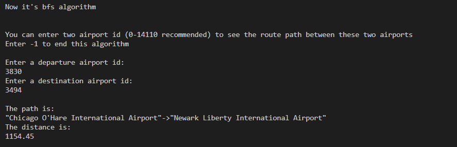
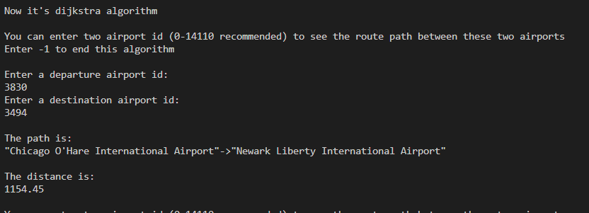
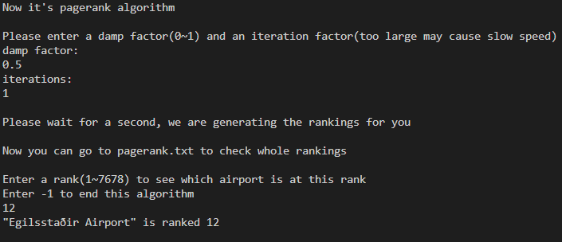

## Result
This report summarizes the output and correctness of each algorithm and discusses how the leading question was answered.

#List of Successful Implementations
- Parsed airport and routes data files (Assigned weights as the distances between two Airports).
- Implemented a Breadth-First Search
- Imlemented Dijkstra’s Algorithm to find the shortest path between two airports
- Implemented PageRank Algorithm to rank all airports by estimating the importance of each airport. (The rank value shows how it’s likely to stop at that airport)

# BFS
The BFS algorithm takes a source airport ID and a destination airport ID and returns a vector of nodes that the BFS traverses through. The adjacency list is created by parsing the airport.dat and routes.dat datasets and storing the connected/neighboring Airport IDs in increasing order. The BFS uses the adjacency list to create the traversal path and marks visited nodes in a vector of booleans. The algorithm was tested on a subset of the data called test_airport.dat and test_routes.dat and was found to be working as intended.

# Dijkstra’s algorithm
The Dijkstra's algorithm takes a source airport ID and a destination airport ID and returns the shortest path between the two airports in the form of a vector of the airports that must be traversed. The algorithm calculates the distances between airports using their latitude and longitude and assigns weights equal to their distance to all edges. The algorithm was tested on a small subset of the data and was found to be working as intended, printing the shortest path consisting of the IDs of the airports.The algorithm was able to correctly calculate and return the shortest path between the two airports. 

# PageRank
The PageRank algorithm in this project is to evaluate the importance of each Airport. This algorithm has O(m+n) time complexity. It counts the number and quality of links among the nodes (airports) to determine a rough estimate of how significant the node (airport) is. The underlying assumption is that more important nodes (airports) are likely to receive more links from other nodes (airports). The algorithm was tested on simple and complex test cases and was found to be working as intended.

# Leading Question
The leading questions addressed in this project are: “what is the connection between airports based on routes and what can we conclude into some connection between popularity of each airport.” We used Dijkstra's shortest path algorithm to find the preferred route using a weighted graph, and we used PageRank algorithm to measure the significance of airports. Our functions correctly find the shortest path between two airports using Dijkstra's algorithm, and pagerank correctly concludes the connection between popularity of each airport. Overall, the project was successful in implementing and testing the BFS, Dijkstra's, and PageRank algorithms. In the future, the team could potentially expand the project to include more complex test cases and improve the efficiency of the algorithms.

